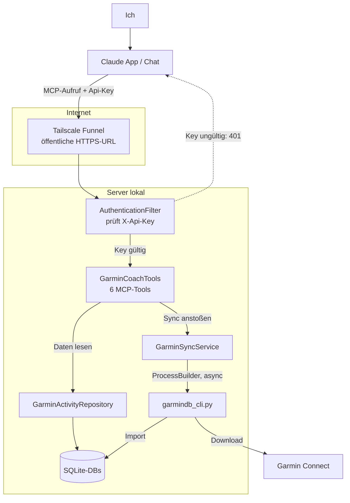

# Garmin Co-Trainer

Spring-Boot-Server, der Garmin-Trainingsdaten als MCP-Tools bereitstellt,
damit Claude direkt als sportwissenschaftlicher Co-Trainer genutzt werden kann. Der Chat läuft auch mobil aus der App.

**Problem:** Trainingsdaten interpretieren (HF-Zonen, Training Effect, VO2max-Trend) ist mühsam, wenn man sie nur als Rohzahlen in Garmin Connect sieht.
Ein eigener Trainer erstellt Pläne, aber Session für Session analysieren und Feedback geben ist zeitaufwendig.
Claude kann das übernehmen, wenn er die Daten direkt abrufen kann.

**Lösung:** Garmin-Daten liegen lokal in SQLite (via [GarminDB](https://github.com/tcgoetz/GarminDB)), der Server macht sie über MCP für Claude nutzbar.
Claude ruft sich die Daten selbst, wenn's im Chat gebraucht wird. Claude hat meine Daten im Kontext und kann mir bei Fragen weiterhelfen.

## Architektur



## Tech-Stack

- Java 21, Spring Boot 4.1
- Spring AI 2.0 (MCP Server, STREAMABLE HTTP)
- Spring Security (API-Key-Auth)
- SQLite (`org.xerial:sqlite-jdbc`), Datenquelle: [GarminDB](https://github.com/tcgoetz/GarminDB)
- Tailscale Funnel für den öffentlichen HTTPS-Zugriff

## MCP-Tools

| Tool | Beschreibung                                                    |
|---|-----------------------------------------------------------------|
| `get_latest_activity_context` | Voller Kontext (Athlet + letzte Aktivität) der neuesten Session |
| `list_recent_activities` | Kurzübersicht der letzten N Aktivitäten                         |
| `sync_garmin_data` | Startet Garmin-Sync im Hintergrund, kehrt sofort zurück         |
| `get_sync_status` | Status des zuletzt gestarteten Syncs                            |
| `get_activity_context` | Voller Kontext für eine bestimmte Aktivität (activity_id)       |
| `get_weekly_summary` | Aggregierte Wochenstatistik über die letzten 8 Wochen           |

## Setup

Lokale Config (`src/main/resources/application-local.properties`, gitignored):
```properties
garmin.activities.datasource.url=jdbc:sqlite:PFAD/ZUR/garmin_activities.db
garmin.sync.script.path=PFAD/ZU/garmindb_cli.py
garmin.sync.python.path=PFAD/ZU/python.exe
api.key=DEIN_GEHEIMER_KEY
spring.ai.mcp.server.instructions=...
```

Athlet-Profil (`src/main/resources/athlete-profile.json`, gitignored) – optional, macht den Kontext persönlicher (Ziel, Constraints, Coach-Notizen). Fehlt die Datei, läuft die App trotzdem.

```bash
./mvnw clean package
java -jar target/trainer-0.0.1-SNAPSHOT.jar
tailscale funnel --bg 8443
```

## Aktueller Stand

Server + alle 6 Tools laufen und sind über den [MCP Inspector](https://github.com/modelcontextprotocol/inspector) getestet. Die echte Nutzung über Claudes Custom Connector hängt aktuell noch an einer Anthropic-seitigen Einschränkung: Die Request-Headers-Funktion für API-Key-Auth bei Custom Connectors ist noch nicht vollständig ausgerollt (Stand: Sommer 2026) – Claude kann den nötigen Auth-Header dadurch noch nicht mitschicken. Details dazu und wie ich draufgekommen bin: [Blogpost folgt].

## Nicht im Scope

- Kein Trainingsplan-Ersteller – das bleibt Aufgabe des menschlichen Trainers
- Keine mobile App, kein eigenes Frontend
- Health-Datenquelle (Ruhepuls/Schlaf aus `garmin.db`) noch nicht angebunden
